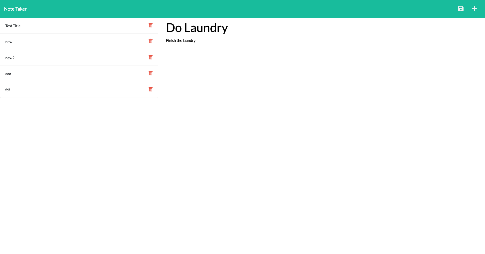

# Note Taker

## Description

The motivation behind this project was to build something to keep track of daily tasks and thoughts. It gives the user a simple yet effective way of taking notes and viewing old ones. It was a great experiance to work with Express.js and learn routing.

## Installation

This application can be accessed through the project's repository or through the deployment link below.  
[Note Taker](https://fathomless-oasis-10431.herokuapp.com/)

## Usage

When you go to the deployment link, you will first see the homepage. Click the get started button and you will be taken to the notes page. You can view previous notes by clicking on them, or add a new note by adding a title and text then clicking the save icon on the right side. 

## License

This app is licensed under the [MIT License](LICENSE)

